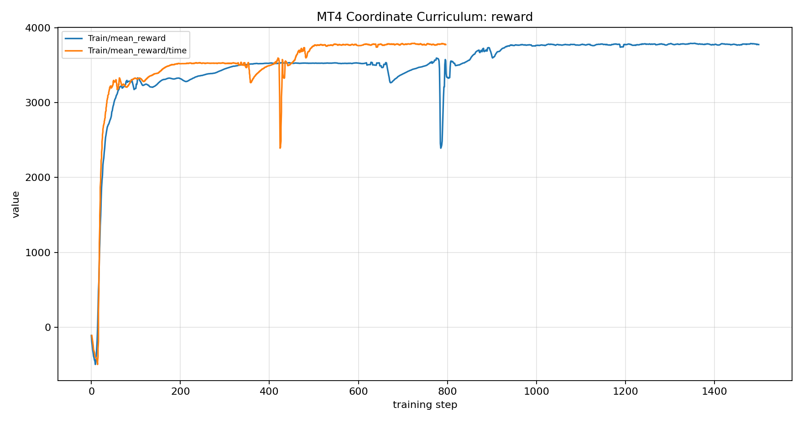
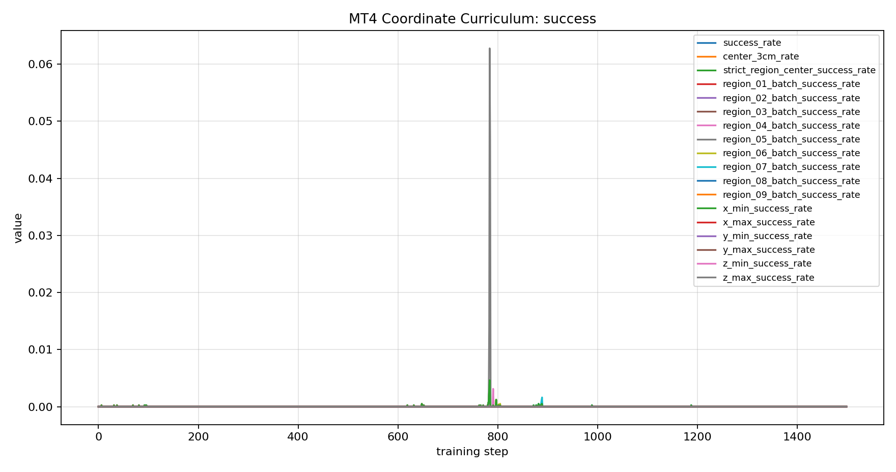
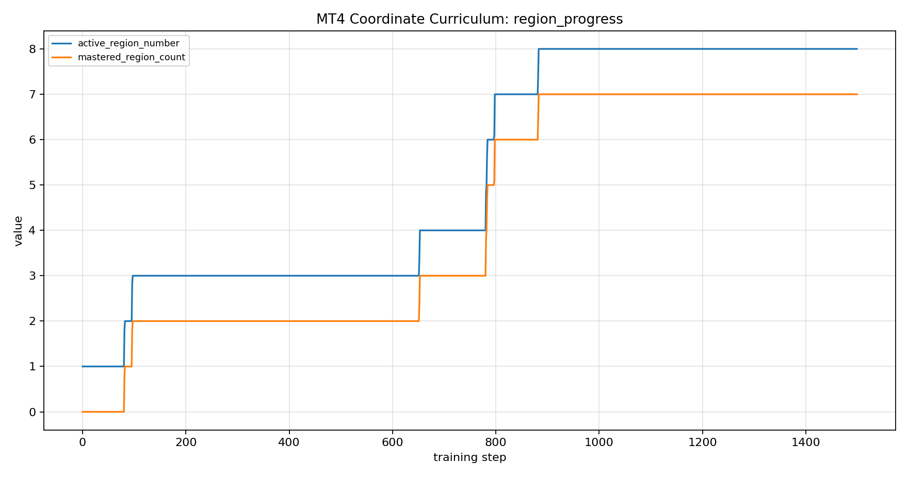
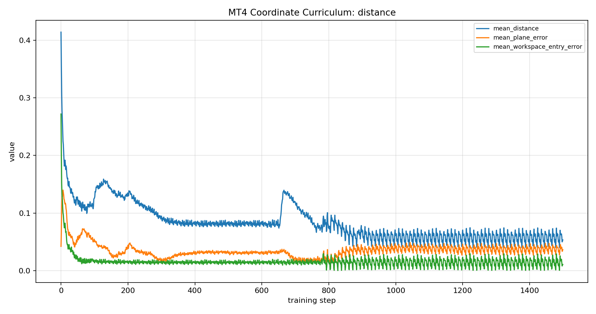
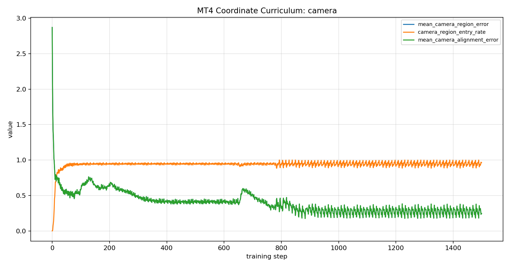
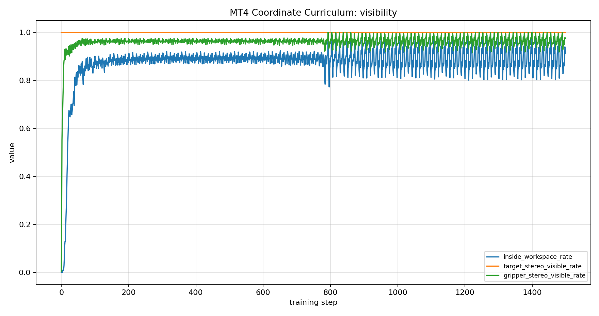
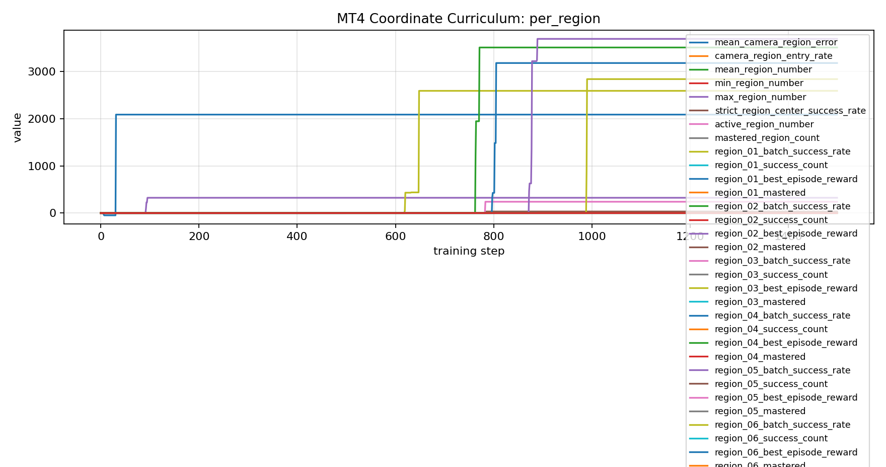
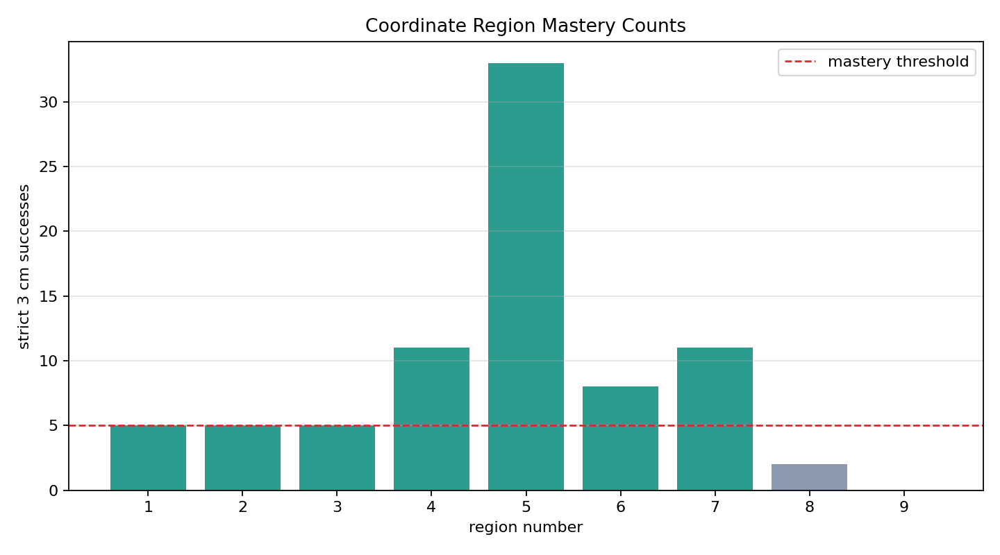

# 2026-06-10_03-13-48 Coordinate Region Mastery Extended Run

## Goal

Increase Stage 1 training iterations while keeping the same strict success rule:

- same stereo camera region as the target
- gripper center within `0.030 m` of the region center target
- target and gripper visible from both virtual cameras

## Run

- Run directory: `/home/spark-robotics/work/isaac/src/IsaacLab/logs/rsl_rl/mt4_coordinate_curriculum_direct/2026-06-10_03-13-48`
- Training command: `TERM=xterm-256color MT4_MAX_ITERATIONS=1500 MT4_RECORD_VIDEO=1 MT4_VIDEO_LENGTH=240 MT4_VIDEO_INTERVAL=12000 scripts/train_coordinate_stage1_plane_128_1500_video.sh`
- Training time: 832.57 seconds (13m 52.57s)
- Final checkpoint: `/home/spark-robotics/work/isaac/src/IsaacLab/logs/rsl_rl/mt4_coordinate_curriculum_direct/2026-06-10_03-13-48/model_1499.pt`
- Video: `logs/videos/20260610_032809_coordinate_region_mastery_1500_2026-06-10_03-13-48.mp4`
- Previous baseline: `experiments/20260610_coordinate_region_mastery_stage1_result.md`

## Final Metrics

| metric | value |
| --- | ---: |
| mean_reward | 3776.7480 |
| success_rate | 0.0000 |
| center_3cm_rate | 0.0000 |
| strict_region_center_success_rate | 0.0000 |
| mean_distance | 0.0534 m (5.34 cm) |
| camera_region_entry_rate | 0.9617 |
| inside_workspace_rate | 0.9116 |
| gripper_stereo_visible_rate | 0.9753 |
| active_region_number | 8 |
| mastered_region_count | 7 |

## Baseline Comparison

| run | iterations | mastered regions | active region | mean distance | note |
| --- | ---: | ---: | ---: | ---: | --- |
| previous baseline | 500 | 2 | 3 | 0.0821 m | stopped before region 3 mastery |
| this run | 1500 | 7 | 8 | 0.0534 m | training-count increase only |

## Region Mastery Snapshot

| Region | Success Count | Best Episode Reward | Mastered | Active |
| --- | ---: | ---: | ---: | ---: |
| 1 | 5 | 2086.467285 | 1 | 0 |
| 2 | 5 | 323.819031 | 1 | 0 |
| 3 | 5 | 2589.660645 | 1 | 0 |
| 4 | 11 | 3508.086914 | 1 | 0 |
| 5 | 33 | 239.662872 | 1 | 0 |
| 6 | 8 | 3178.872070 | 1 | 0 |
| 7 | 11 | 3690.524170 | 1 | 0 |
| 8 | 2 | 2838.136963 | 0 | 1 |
| 9 | 0 |  | 0 | 0 |

## Plots

### reward

### success

### region_progress

### distance

### camera

### visibility

### per_region

### region_mastery_counts

## Student Idea vs. Codex Implementation

User proposal:

- Keep the distance criterion fixed at `0.030 m`.
- Treat success as numbered region mastery, not as one global success rate.
- Continue one policy from region to region and preserve the best behavior record per region.
- Visualize the run so students can inspect what the agent actually learned.

Codex implementation:

- Increased Stage 1 from 500 to 1500 iterations.
- Kept the strict 3 cm success rule unchanged.
- Recorded training video through Gym `RecordVideo`.
- Generated coordinate-specific TensorBoard plots, final metrics CSV, checkpoint CSV, and this report.

## Interpretation

- Increasing the training count helped substantially: the policy advanced from 2 mastered regions to 7 mastered regions.
- The run still did not master all 9 regions. It ended in region 8 with 2 strict successes, so the next bottleneck is region 8 rather than region 3.
- The final global success-rate scalar is still `0.0000` because the active region batch did not contain a strict success at the final logging step. The per-region success counts are the more useful curriculum progress signal.
- The distance criterion was not relaxed. Every mastered region was counted with the same 3 cm strict success rule.
- Next fix: keep the 3 cm mastery rule, but add stronger dense shaping below 7 cm or checkpoint-resume orchestration around the active unmastered region.

Generated at `2026-06-10T03:28:57`.
