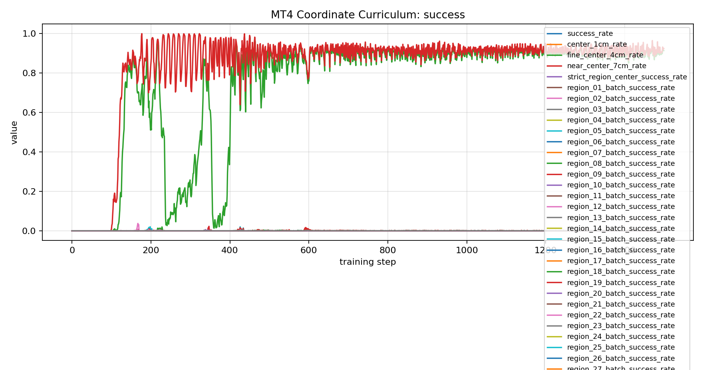
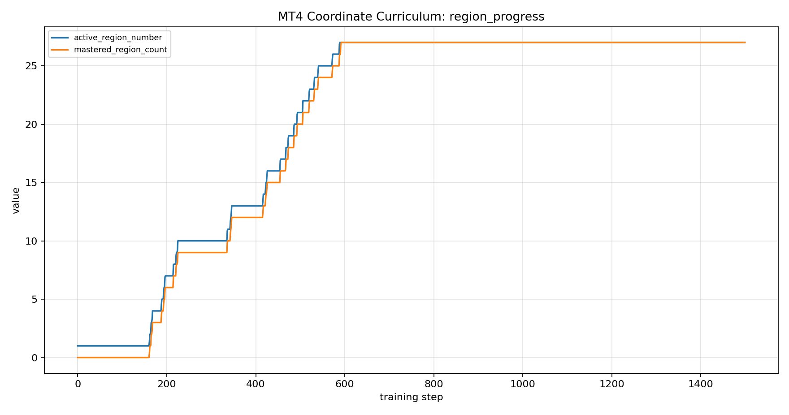
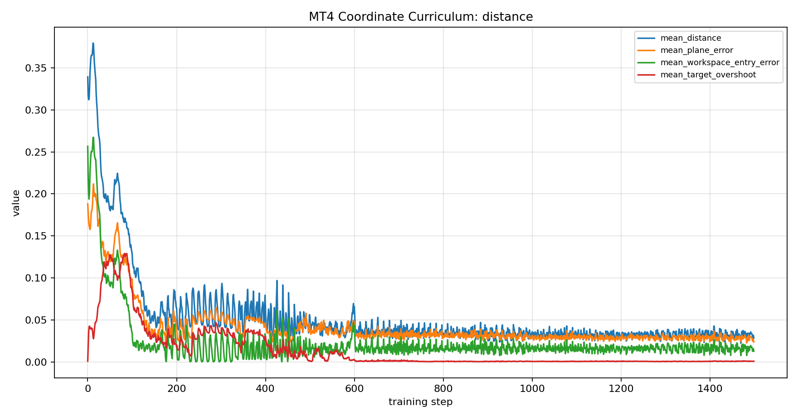
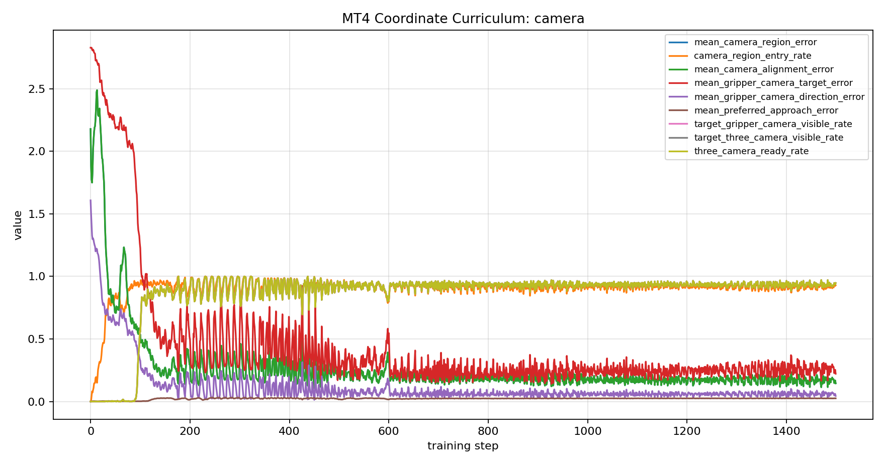
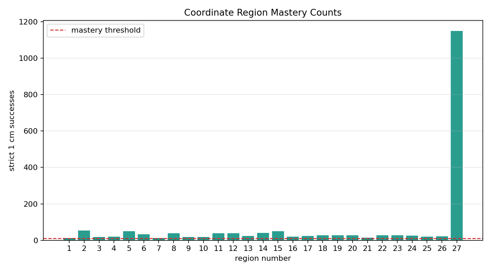

# 2026-06-10 Reach-Limited 27-Region Success and Precision Plan / 가동범위 기반 27영역 성공 분석과 정밀 제어 계획

## Summary / 요약

이번 실험의 핵심 결론은 `27개 영역이라서 실패한 것`이 아니라, 처음 지정한 27개 영역 박스가 현재 MT4 모델의 안정 가동범위와 학습 시작 조건을 벗어났다는 점이다. 넓은 박스에서는 첫 영역부터 gripper가 작업공간 안으로 들어오지 못했고, 첫 보수 박스에서는 18개 영역까지 진행한 뒤 가까운 높은 코너인 19번 영역에서 멈췄다. 이후 박스를 더 줄여 `center=(0.305, 0.00, 0.205)`, `size=(0.09, 0.14, 0.09)`로 제한하자 27개 영역을 모두 1cm 엄격 조건으로 마스터했다.

교육적으로는 좋은 실패다. 실제 Mirobot으로 옮겨도 먼저 조인트 제한과 안정 작업영역을 계산하고, 그 안에서 영역을 나눈 뒤, 카메라 정렬과 정밀 접근을 학습시켜야 한다는 순서가 명확해졌다.

## Run Chain / 실행 흐름

| step | workspace | result | lesson |
| --- | --- | --- | --- |
| wide 3x3x3 | 기존 넓은 27영역 | `mastered_region_count=0`, `inside_workspace_rate=0.0000` | 영역 개수보다 작업공간 위치가 먼저 문제였다. |
| first reach-limited 3x3x3 | `center=(0.30,0.00,0.21)`, `size=(0.12,0.16,0.12)` | 18개 영역 마스터 후 19번에서 정지 | 일부 코너는 샘플상 가능해 보여도 안정 학습 영역 밖일 수 있다. |
| conservative reach-limited 3x3x3 | `center=(0.305,0.00,0.205)`, `size=(0.09,0.14,0.09)` | 27개 영역 전체 마스터 | 먼저 안정 작업 박스를 정한 뒤 27영역을 나누는 방식이 맞다. |

## Final Successful Run / 최종 성공 실행

| item | value |
| --- | --- |
| run dir | `/home/spark-robotics/work/isaac/src/IsaacLab/logs/rsl_rl/mt4_coordinate_curriculum_direct/2026-06-10_16-47-53_volume_3x3x3_target_tracking_128env_1500iter` |
| task | `Isaac-MT4-Coordinate-Volume-Direct-v0` |
| command | `scripts/train_coordinate_stage1_volume_128_1500_video.sh` |
| checkpoint | `model_1499.pt` |
| workspace center | `(0.305, 0.00, 0.205)` |
| workspace size | `(0.09, 0.14, 0.09)` |
| success rule | same 3D cell, within `0.010 m`, target visible from body stereo and gripper camera |

## Final Metrics / 최종 수치

| metric | value |
| --- | ---: |
| `mastered_region_count` | 27 |
| `active_region_number` | 27 |
| `mean_distance` | 0.0283 m |
| `fine_center_4cm_rate` | 0.9141 |
| `near_center_7cm_rate` | 0.9250 |
| `camera_region_entry_rate` | 0.9287 |
| `camera_region_match_rate` | 1.0000 |
| `target_stereo_visible_rate` | 1.0000 |
| `target_gripper_camera_visible_rate` | 0.9470 |
| `target_three_camera_visible_rate` | 0.9470 |
| `three_camera_ready_rate` | 0.9470 |
| `mean_gripper_camera_direction_error` | 0.0442 |
| `mean_target_overshoot` | 0.0008 m |

주의할 점은 최종 `success_rate=0.0000`이 실패를 뜻하지 않는다는 점이다. 이 값은 마지막 로깅 배치 기준이고, 커리큘럼의 실제 성과는 영역별 누적 성공 카운트와 `mastered_region_count`로 봐야 한다. 이번 실행에서는 모든 영역이 10회 이상 1cm 성공 조건을 만족해 마스터 처리됐다.

## Graphs / 그래프

### Success and Precision Bands

### Region Progress

### Distance and Overshoot

### Camera Alignment and Visibility

### Region Mastery Counts

Raw tables:

- [final metrics CSV](artifacts/20260610_164753_reach_limited_27_final_metrics.csv)
- [region mastery CSV](artifacts/20260610_164753_reach_limited_27_region_mastery.csv)
- [27-cell workspace audit](artifacts/20260610_164753_workspace_reach_limited_27_cells.md)

## Analysis / 분석

넓은 27영역 실패에서는 목표가 몸체 카메라에는 보였지만 gripper가 작업공간에 들어가지 못했다. 이 상태에서 보상을 아무리 줘도 정책은 첫 셀의 1cm 조건을 만날 수 없다. 따라서 영역 수를 줄이는 문제라기보다, 로봇팔이 안정적으로 접근할 수 있는 박스를 먼저 찾아야 했다.

첫 보수 박스의 19번 실패는 더 미묘했다. 목표는 세 카메라에 대체로 보였고 gripper camera 방향 오차도 줄었지만, 중심까지 평균 8-9cm 근처에서 정체했다. 즉 카메라 인식 실패가 아니라 가까운 높은 코너의 기구학적/학습 안정성 문제로 보는 것이 맞다.

최종 보수 박스에서는 27개 영역을 모두 마스터했다. 특히 `target_three_camera_visible_rate=0.9470`, `three_camera_ready_rate=0.9470`이므로, 사용자가 제안한 "몸체 두 카메라와 집게 카메라 모두로 목표를 확인하고 움직인다"는 방향이 유효했다. 다만 평균 거리는 2.83cm이고 4cm 이내 비율은 높지만, 5mm급 정밀 제어로 보려면 별도 단계가 필요하다.

## Recommendations / 제안사항

1. 실제 로봇 또는 새 모델로 옮길 때는 먼저 조인트 제한 기반 workspace audit을 자동으로 실행한다.
2. 전체 도달 외피를 그대로 쓰지 말고, gripper 중심이 안정적으로 접근하고 카메라 세 대가 볼 수 있는 보수 박스를 사용한다.
3. 27개 영역은 유지해도 되지만, 각 영역의 가까운/먼/높은/낮은 코너가 모두 안정 박스 안에 들어오는지 확인한다.
4. 성공률은 마지막 배치 값보다 `mastered_region_count`, 영역별 `success_count`, `mean_distance`, `fine_center_4cm_rate`, `target_three_camera_visible_rate`를 함께 본다.
5. 다음 단계는 영역 인식이 아니라 정밀 제어다. 27영역을 모두 찾는 능력은 확보됐으므로, 이제 같은 박스 안에서 5mm 중심 접근, 낮은 overshoot, 낮은 action scale을 목표로 한다.

## Precision Control Plan / 정밀 제어 계획

다음 실험은 Stage 2로 분리한다.

| item | proposed value |
| --- | --- |
| task | `Isaac-MT4-Coordinate-Volume-Precision-Direct-v0` |
| starting point | `2026-06-10_16-47-53 ... model_1499.pt` warm start |
| workspace | same conservative 27-cell box |
| success radius | `0.005 m` |
| fine band | `0.020 m` |
| action scale | reduce from `0.040` to about `0.015` |
| reward focus | 5mm center reward, smooth action, low joint velocity, low overshoot |
| stop condition | 27 regions mastered under 5mm rule or clear plateau |

이 단계에서는 새 영역을 더 넓히지 않는다. 이미 27영역 인식은 통과했으므로, 먼저 같은 영역 안에서 더 천천히 정확히 들어가는 정책을 학습시키는 것이 맞다.

Generated at `2026-06-10T17:16:26+09:00`.
