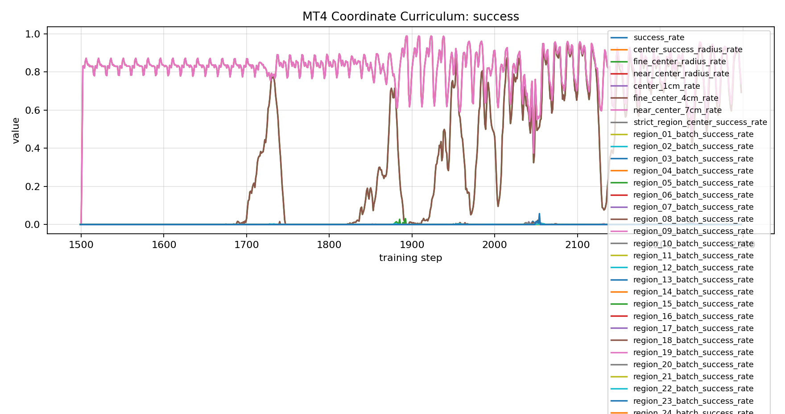
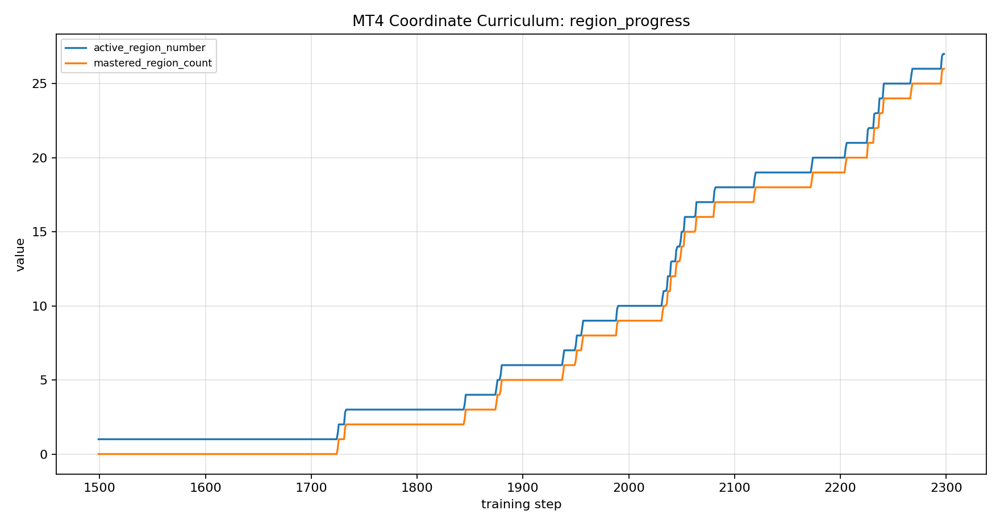
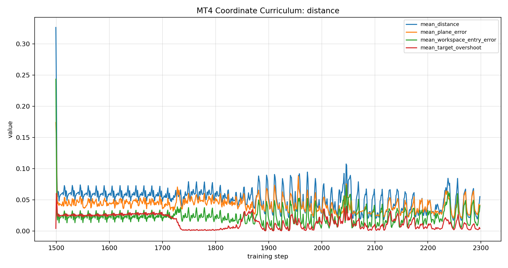
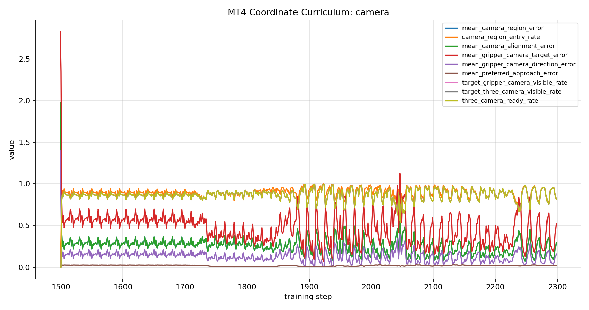
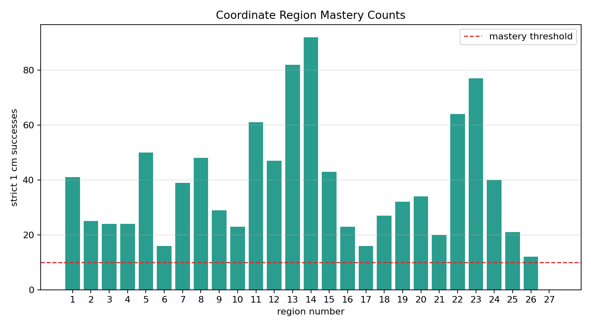

# 2026-06-10 5mm Volume Precision Run / 5mm 볼륨 정밀 제어 실행

## Summary / 요약

27영역 1cm 마스터 정책에서 warm start해, 같은 reach-limited 3x3x3 작업영역 안에서 5mm 정밀 제어를 시도했다. 800 iteration 실행 결과 27개 중 26개 영역을 5mm 조건으로 마스터했고, 마지막 27번 영역만 남았다.

결론은 긍정적이다. 5mm 조건은 1cm보다 훨씬 어렵지만, 기존 27영역 정책을 기반으로 정밀 제어가 실제로 열렸다. 다만 최종 batch 기준으로는 27번 영역에서 카메라 준비율과 workspace 진입률이 떨어져 끝까지 완료하지 못했다.

## Run / 실행

| item | value |
| --- | --- |
| run dir | `/home/spark-robotics/work/isaac/src/IsaacLab/logs/rsl_rl/mt4_coordinate_curriculum_direct/2026-06-10_17-37-50_volume_precision_5mm_128env_800iter` |
| task | `Isaac-MT4-Coordinate-Volume-Precision-Direct-v0` |
| command | `scripts/train_coordinate_stage2_volume_precision_128_800_video.sh` |
| warm start | `2026-06-10_16-47-53_volume_3x3x3_target_tracking_128env_1500iter/model_1499.pt` |
| training time | `928.07 s` |
| final checkpoint | `model_2298.pt` |
| success radius | `0.005 m` |
| fine band | `0.020 m` |
| action scale | `0.015` |

## Final Metrics / 최종 수치

| metric | value |
| --- | ---: |
| `mastered_region_count` | 26 |
| `active_region_number` | 27 |
| `mean_distance` | 0.0551 m |
| `center_success_radius_rate` | 0.0000 |
| `fine_center_radius_rate` | 0.6934 |
| `near_center_radius_rate` | 0.7393 |
| `camera_region_entry_rate` | 0.8083 |
| `camera_region_match_rate` | 1.0000 |
| `target_three_camera_visible_rate` | 0.8098 |
| `three_camera_ready_rate` | 0.8098 |
| `target_overshoot` | 0.0038 m |
| `gripper_camera_direction_error` | 0.1590 |

최종 batch의 `success_rate=0.0000`은 마지막 27번 영역의 순간값이다. 이 run의 핵심 성과는 누적 영역 마스터리이며, 1-26번 영역은 모두 5mm 성공 조건을 통과했다.

## Region Mastery / 영역 마스터리

| range | result |
| --- | --- |
| regions 1-24 | 모두 안정적으로 마스터 |
| region 25 | 21 successes, mastered |
| region 26 | 12 successes, mastered |
| region 27 | 0 successes, active at end |

## Graphs / 그래프

### Success and Precision Bands

### Region Progress

### Distance

### Camera

### Region Mastery Counts

Raw tables:

- [final metrics CSV](artifacts/20260610_173750_precision_5mm_final_metrics.csv)
- [region mastery CSV](artifacts/20260610_173750_precision_5mm_region_mastery.csv)

## Interpretation / 해석

초반에는 평균 거리가 5-6cm 근처에 머물렀고 2cm band도 열리지 않았다. 하지만 중반 이후 2cm band가 0.8 이상으로 올라가면서 5mm 성공이 누적되기 시작했다. 이는 1cm 영역 정책이 단순히 영역 중심을 대략 찾는 데 그치지 않고, 더 작은 성공 반경으로 fine-tuning될 수 있다는 뜻이다.

마지막 27번 영역에서 멈춘 이유는 5mm 자체보다, 해당 영역에서 camera-ready와 workspace 안정성이 동시에 떨어진 영향이 크다. 최종 batch 기준 `three_camera_ready_rate=0.8098`, `inside_workspace_rate=0.7646`으로, 24-26번을 통과하던 구간보다 낮다.

또 하나의 관찰점은 action std가 커졌다는 점이다. 정밀 제어에서는 action scale은 낮췄지만 PPO 정책 분산은 계속 커졌다. 실제 로봇 이전을 생각하면 다음 실험에서는 entropy 또는 action std를 줄이는 설정이 필요하다.

## Next Recommendation / 다음 제안

1. 같은 checkpoint에서 `400-600` iteration만 추가로 이어서 27번 영역 완료 여부를 확인한다.
2. 실패하면 27번만 별도 single-active-region debug run으로 분리해 카메라 시야와 workspace 경계를 확인한다.
3. 다음 정밀 run은 `entropy_coef` 또는 action std를 낮춰 마지막 접근 흔들림을 줄인다.
4. 실제 Mirobot 전이는 아직 하지 않는다. 5mm 기준 27/27을 시뮬레이션에서 먼저 통과시키는 것이 맞다.

Generated at `2026-06-10T17:54:00+09:00`.
